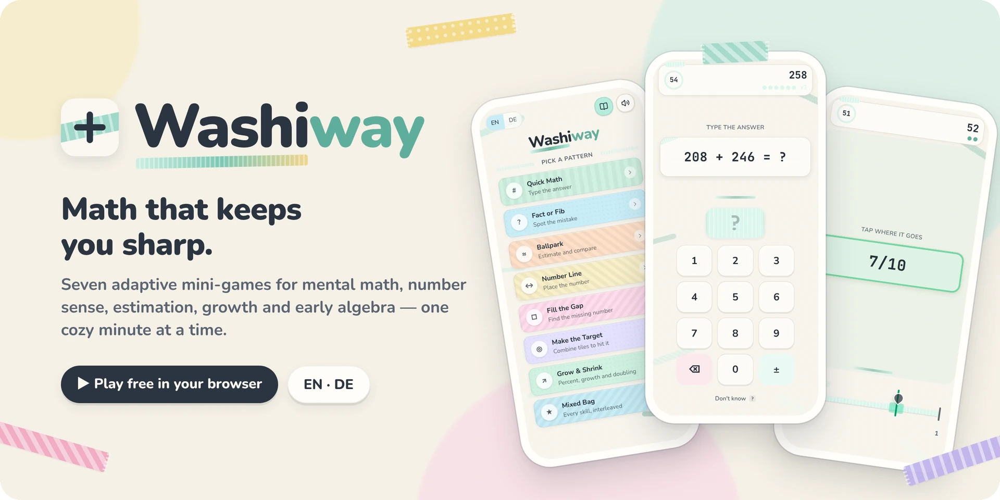
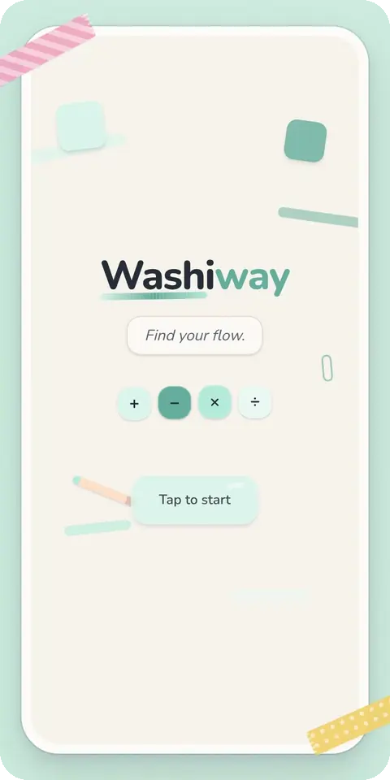
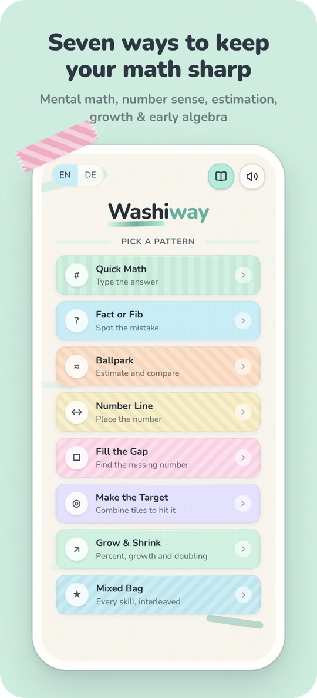
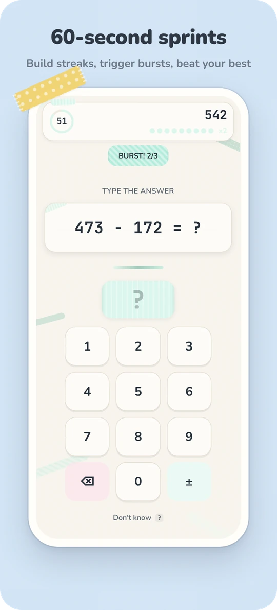
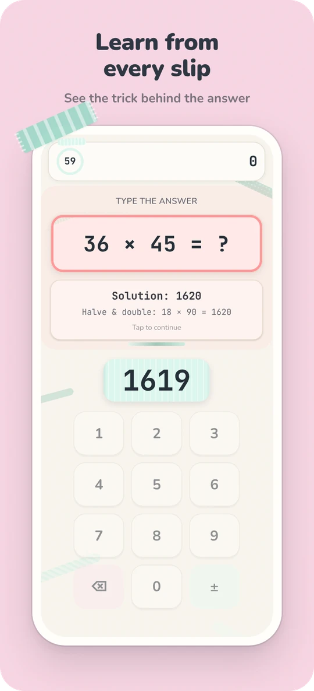
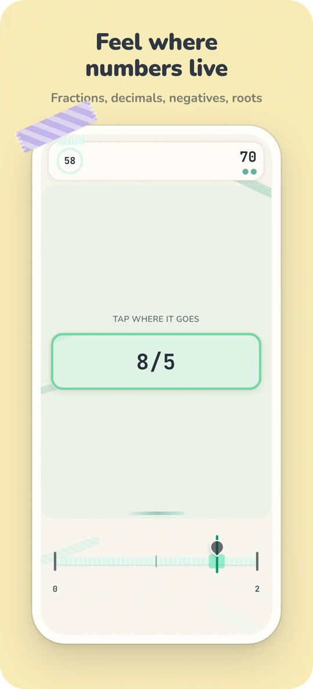
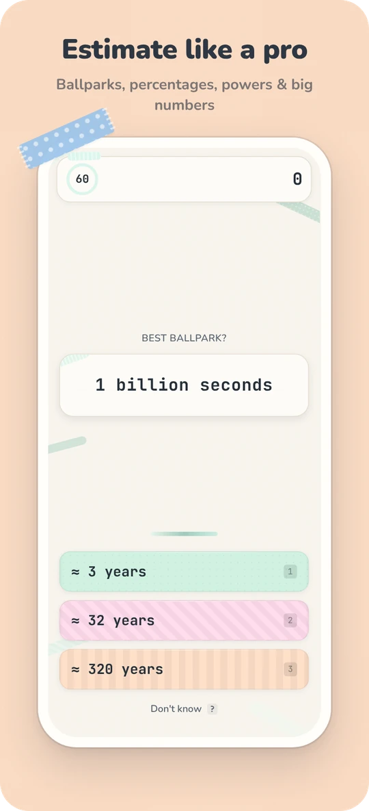
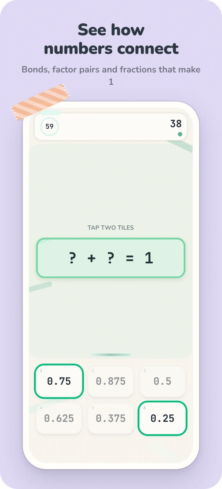
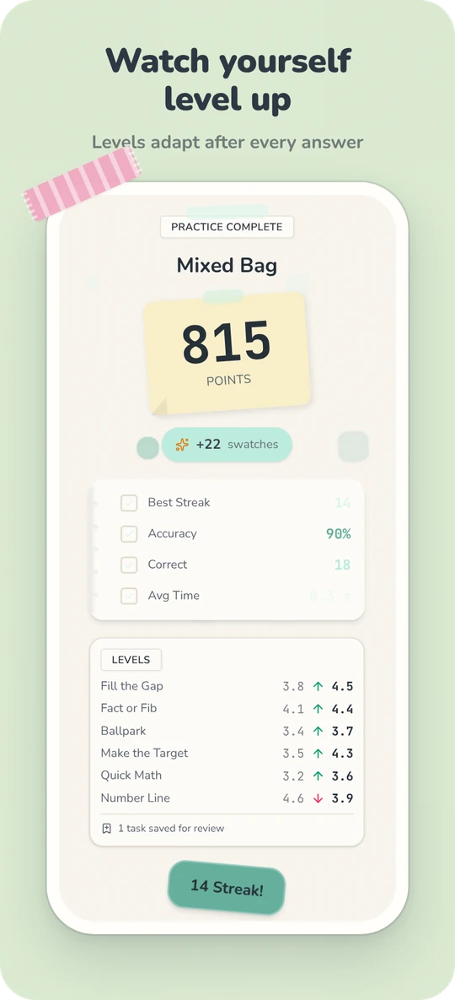
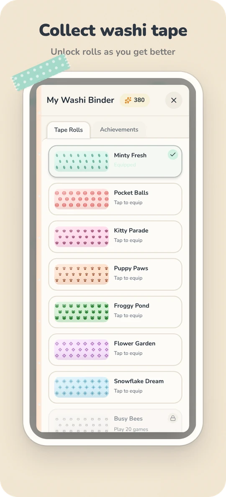

<p align="center">
  <a href="https://saschb2b.github.io/washiway/">
    
  </a>
</p>

<p align="center">
  <a href="https://saschb2b.github.io/washiway/"></a>
  <a href="https://github.com/saschb2b/washiway/actions/workflows/deploy.yml"></a>
  
  
</p>

<h3 align="center">Six adaptive mini-games that keep your math sharp — one cozy minute at a time.</h3>

<p align="center">
  Mental math, number sense, estimation and early algebra for teens and adults.<br>
  No account, no ads, no install. It runs in your browser and keeps your progress on your device.
</p>

<p align="center">
  
</p>

## Screenshots

<p align="center">
  
  
  
  
</p>
<p align="center">
  
  
  
  
</p>

## Six skills, one cozy routine

|       | Mode                | You practice                                                                              | For example                    |
| :---: | ------------------- | ----------------------------------------------------------------------------------------- | ------------------------------ |
| **#** | **Quick Math**      | Mental arithmetic, from making ten to two-digit products, squares, percentages and chains | `48 × 52` → `50² − 2² = 2496`  |
| **?** | **Fact or Fib**     | Checking results fast — and spotting classic traps                                        | `1/2 + 1/3 = 2/5`? Fib.        |
| **≈** | **Ballpark**        | Estimating and comparing: products, percentages, fractions, powers, everyday magnitudes   | `1 billion seconds` ≈ 32 years |
| **↔** | **Number Line**     | A precise feel for where numbers live — fractions, decimals, negatives, roots             | Place `7/8`, `−5/4`, `√47`     |
| **□** | **Fill the Gap**    | Inverse operations, the equals sign as a balance, patterns, first algebra                 | `6x + 18 = x + 13`             |
| **◎** | **Make the Target** | Seeing number relationships at a glance                                                   | `? × ? = 187` → `11 × 17`      |
| **★** | **Mixed Bag**       | Everything above, interleaved                                                             | —                              |

Every skill has **10 levels** that adapt after each answer, so a round is never boring and never hopeless.

## Why it works

Washiway is built on what research on math practice supports — and doesn't claim more. Brain-training games don't make you smarter in general; practice makes you better at what you practice. So Washiway practices the things worth getting good at.

- **Your level finds you.** Each skill moves up a little after a correct answer (more when fast) and down more after a miss, settling where you succeed about 80% of the time — the zone adaptive systems like [Math Garden](https://www.klinkenberg.amsterdam/publication/math-garden/) aim for.
- **Guessing doesn't pay.** Points follow the "high speed, high stakes" rule ([Maris & van der Maas, 2012](https://dare.uva.nl/id/257c9569-e69c-466b-b813-c48c1e65942c)): fast and right earns most, a fast wrong guess costs as much, and "Don't know" costs nothing.
- **Mistakes teach.** After a miss you see the answer and the strategy behind it. Corrective feedback is what makes retrieval practice stick ([Pashler et al., 2005](https://digitalcommons.usf.edu/psy_facpub/1773)).
- **Misses come back.** A missed task returns a few questions later and again at the start of your next session (spaced, successive relearning).
- **Mixing beats blocking.** Interleaved practice feels harder but is remembered better ([Rohrer & Taylor, 2007](https://digitalcommons.usf.edu/psy_facpub/1767/)).
- **Number sense, not just drills.** Number-line accuracy and fraction magnitude knowledge are linked to later math achievement ([Schneider et al., 2018](https://www.uni-trier.de/fileadmin/fb1/prof/PSY/PAE/Team/Schneider/SchneiderEtAl2018.pdf); [Siegler et al., 2012](https://www.psychologicalscience.org/news/releases/knowledge-of-fractions-and-long-division-predicts-long-term-math-success.html)).

<details>
<summary><b>What each skill trains, in detail</b></summary>

| Skill               | What it trains                                                                                          | Why                                                                                                                                 |
| ------------------- | ------------------------------------------------------------------------------------------------------- | ----------------------------------------------------------------------------------------------------------------------------------- |
| **Quick Math**      | A 10-level ladder from making ten to two-digit products, squares, percentages and multi-step chains     | Fluency comes from retrieval plus strategies (compensation, near squares, ×11, x% of y = y% of x); every miss shows the strategy    |
| **Fact or Fib**     | Judging claims: near-miss results and misconceptions (1/2 + 1/3 ≠ 2/5, +50% −50% ≠ 0)                   | Wrong claims are never far off, so a glance can't reject them; a real check (last digit, parity, rough size, working backwards) can |
| **Ballpark**        | Closest estimate and "which is bigger" for products, percentages, fractions, powers and Fermi questions | Estimation matters in daily life, and knowing fraction magnitudes is linked to later algebra success                                |
| **Number Line**     | Placing whole numbers, negatives, fractions, decimals, roots and constants                              | Number-line accuracy correlates with math achievement (r ≈ .44 in a meta-analysis), most strongly for fractions                     |
| **Fill the Gap**    | Inverse operations, the equals sign as a balance, number patterns, linear equations                     | Relational understanding of "=" and solving for an unknown are the bridge to algebra                                                |
| **Make the Target** | Pick tiles that make a number: bonds to 10/100/1000/1, factor pairs, differences                        | Seeing number relationships at a glance is what fluent calculators do                                                               |
| **Mixed Bag**       | All skills interleaved                                                                                  | Interleaved practice is remembered better than blocked practice                                                                     |

The generators live in `lib/math/`. Tests recompute every generated task with an independent expression evaluator across all skills and levels, and simulate players of different strength to check that levels settle where they should.

</details>

## Features

- 🎯 **Adaptive levels 1–10** per skill, saved between sessions
- ⏱️ **60-second sprints** with streaks, multipliers and burst bonuses — or **20 tasks without a clock**
- 💡 **Worked solutions** after every miss, and a **review deck** of tasks to revisit
- 🎀 **Washi binder** — unlock themed tape rolls through achievements and re-theme the whole app
- ⌨️ **Keyboard support** for every input
- 🌍 **English and German**, picked from your browser
- 🔒 **Private by design** — no account, no tracking; progress stays in your browser's local storage

## Play

**[saschb2b.github.io/washiway](https://saschb2b.github.io/washiway/)** — works on phones, tablets and desktops.

---

## Development

Built with [Next.js 16](https://nextjs.org) (static export), [React 19](https://react.dev), [Tailwind CSS 4](https://tailwindcss.com), [Motion](https://motion.dev), the Web Audio API, TypeScript and Vitest. Hosted on GitHub Pages.

Requires Node.js 22 or newer (CI uses the version in `.nvmrc`) and pnpm. With Corepack enabled, the pnpm version pinned in `package.json` is used automatically.

```bash
corepack enable
pnpm install
pnpm dev
```

Open [http://localhost:3000](http://localhost:3000) to play.

| Command             | What it does                                 |
| ------------------- | -------------------------------------------- |
| `pnpm dev`          | Start the dev server                         |
| `pnpm build`        | Build the static site into `out/`            |
| `pnpm preview`      | Serve `out/` locally                         |
| `pnpm lint`         | Run ESLint                                   |
| `pnpm typecheck`    | Run the TypeScript compiler without emitting |
| `pnpm test`         | Run the math engine tests                    |
| `pnpm format`       | Format all files with Prettier               |
| `pnpm format:check` | Check formatting (CI runs this)              |

### Deployment

The site is a fully static export (`output: "export"` in `next.config.ts`) published by [`.github/workflows/deploy.yml`](.github/workflows/deploy.yml). Every pull request is linted, type-checked, format-checked, tested and built; every push to `main` also deploys to GitHub Pages. Pages serves the project from `/washiway`, so the workflow passes that prefix to the build through `PAGES_BASE_PATH`; locally the app runs at the root.

To enable deployments on a fork, open **Settings → Pages** and set **Source** to **GitHub Actions**. For a nice link preview, upload [`docs/readme/social-preview.png`](docs/readme/social-preview.png) under **Settings → General → Social preview**.

<details>
<summary><b>Project structure</b></summary>

```
├── app/                      # Next.js app router (layout, page, global styles, icon)
├── components/
│   ├── game/                 # Game screens and inputs
│   │   ├── inputs/           # Keypad, true/false, choices, number line, target tiles
│   │   └── ...               # Screens, overlays, binder, UI pieces
│   ├── ui/                   # Stationery components (sticky notes, washi tape, ...)
│   └── math-game.tsx         # Main game orchestrator
├── lib/
│   ├── math/                 # Task generators, answer checking, adaptive levels and scoring (+ tests)
│   ├── game-context.tsx      # Game flow: questions, feedback, review queue
│   ├── skill-context.tsx     # Saved levels and review decks
│   ├── settings-context.tsx  # Best scores
│   ├── progression-context.tsx # Washi rolls, achievements, unlocks
│   ├── theme-context.tsx     # Applies the equipped roll's colors and pattern
│   ├── audio-context.tsx     # Sound effects, music
│   ├── i18n-context.tsx      # Translations
│   └── game-types.ts         # TypeScript types
├── public/sounds/            # Sound effects and background music
├── docs/readme/              # Images for this README
└── .github/workflows/        # CI and GitHub Pages deployment
```

</details>

<details>
<summary><b>Contributing</b></summary>

1. Fork the repository
2. Create a feature branch (`git checkout -b feature/new-mode`)
3. Make your changes
4. Run `pnpm lint`, `pnpm typecheck`, `pnpm test`, and `pnpm build` to verify there are no errors
5. Submit a pull request

**Adding a task family.** Each skill in `lib/math/skills/` has a `TIERS` table mapping levels 1–10 to weighted builders. Add a builder that returns a question draft with a worked `explanation`, list it in the tiers where it fits, and run `pnpm test` — the tests recompute every answer.

**Adding a new skill.**

1. Add it to `SKILLS` and `GAME_MODES` in `lib/math/types.ts` and register its generator in `lib/math/engine.ts`
2. Reuse an existing question kind (number, true/false, choice, number line, target) or add a new kind with an input in `components/game/inputs/`, wired up in `components/game/game-screen.tsx`
3. Add its color, pattern, and icon to `MODE_STYLES` in `components/game/mode-styles.ts`
4. Add translations to `lib/i18n-context.tsx`

**Adding a new language.**

1. Add the locale to the `Language` type in `lib/math/types.ts`
2. Add a translations object in `lib/i18n-context.tsx`, and the new language to every `L(...)` text in `lib/math/`
3. Add it to `LANGUAGES` in `components/game/language-toggle.tsx`

</details>

## Credits

Background music: "Morning Routine" by Ghostrifter Official, via [chosic.com](https://www.chosic.com).

## License

MIT
